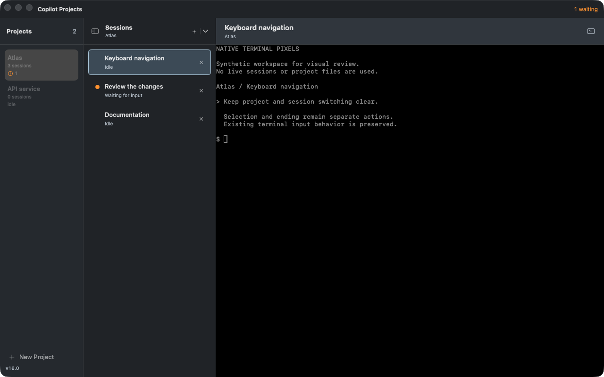
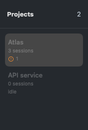

# Copilot Projects

A native macOS terminal workspace for keeping coding-agent sessions organized.
Projects live in the sidebar, sessions live in tabs, and status indicators tell
you what is running, what needs input, and what finished while you were away.



Captured from a separate instance of the current app with sample projects and
illustrative terminal text. No live workspace content is shown.

## Install

Requires **macOS 26 or later on Apple Silicon**.

Download the latest `Copilot-Projects-<version>.dmg` from
[Releases](https://github.com/sirfergy/copilot-projects/releases), open it, and drag
**Copilot Projects** into **Applications**. Published release builds are Developer
ID–signed, notarized, and stapled.

This repository builds the **standalone desktop app**. Web access, mobile-client
connectivity, tunnel authentication, and remote push delivery are maintained and
built separately; they are not included in the public desktop distribution.
If you already use a remote-enabled installation, keep using its integrated
distribution rather than replacing it with the standalone download.

## Remote screenshot attachments

Remote integrations can stage PNG/JPEG screenshots privately and attach them to
an existing Copilot conversation through the native SDK message path. This needs
an updated integrated host/client and a restarted Copilot tracker advertising
`image-attachments-v1`; text-only clients remain compatible. The tracker verifies
the selected model's image limits and resolves session/epoch-bound upload IDs to
inline image bytes before sending. Missing or unsupported images reject the
whole message, never fall back to terminal input.

Uploads are limited to four images, 2 MiB each, and 16 megapixels, further reduced
by the selected model's limits. They live outside project repositories in the
private state directory, expire after seven days, and are reclaimed on subsequent
uploads. Storage is capped at 128 MiB/128 entries without evicting unexpired
uploads. This repository does not add an upload UI to the standalone desktop app.

Remote transcript images keep their original turn when the terminal retransmits
unchanged, still-advertised image data. A redraw does not move an older image to
the newest reply. This retains the existing one-image-per-terminal-ID model;
it does not reconstruct attachment history after image data has been discarded.

## A workspace for parallel work

- **Projects and tabs.** Group sessions by project without juggling terminal
  windows. Background tabs keep running while you work elsewhere.
- **Attention at a glance.** Running and waiting indicators, unread markers,
  and native notifications help you find the session that needs you.
- **Session details.** Read completed turns as Markdown and see usage,
  background agents, and schedules when the
  connected Copilot CLI supports them.
- **Local pull-request reviews.** Choose **Review Pull Request…** from the split
  button's dropdown to open a Copilot CLI session with a local adversarial-review
  prompt for a GitHub pull request.
- **Resumable terminals.** The bundled `dtach` backend keeps shells and agents
  alive when the app quits or relaunches. You can also reattach over SSH.

Copilot CLI hooks and a local tracker supply automatic status and session
details. Other command-line tools work as ordinary terminal sessions and can
report status through the CLI.

### A closer look



This component preview uses illustrative sample data.

## Everyday controls

| Action | Shortcut |
|---|---|
| New project | `⌘N` |
| New Copilot session | `⌘T` |
| New plain terminal | `⌥⌘T` |
| End the current session | `⌘W` |
| Next / previous session | `⌃Tab` / `⌃⇧Tab` |
| Jump to a project | `⌘1`–`⌘9` |
| Jump to a session | `⌃1`–`⌃9` |

Hold `⌘` or `⌃` to reveal numbered navigation hints. Use the session-details
button to open the completed-turn drawer.

VoiceOver exposes each session's selection and attention state, with separate
select and end actions. The session-details drawer uses a fade instead of
sliding when Reduce Motion is enabled.

The **+** side of the split button starts an interactive Copilot CLI session immediately,
inheriting the current session's working directory. Its dropdown offers
**Start with Prompt…** (a multiline composer), **New Terminal** (just a shell), and
**Review Pull Request…** (a GitHub pull request URL dialog).
The Session menu and project context menus also offer Copilot, starting-prompt,
and plain-terminal creation. New projects
created with `⌘N` also start with Copilot. All new desktop Copilot sessions use
`--allow-all`, with or without a starting prompt.

In the composer, Return adds a line, `⌘Return` starts Copilot, and Cancel creates
no tab. Failed preflight checks keep your draft. If Copilot or its backend becomes
unavailable, choosing **New Terminal** discards the draft and opens a plain shell
without submitting it. If startup fails after a tab opens, right-click that tab
and choose **Copy Starting Prompt** before closing it or quitting the app. This
in-memory copy is never automatically resubmitted.

**Closing a tab ends that session. Quitting the app does not**, when the bundled
`dtach` backend is available. Closing the last window quits by default; enable
**Keep Running When Window Closes** to leave the host in the menu bar.
Plain-shell scrollback does not survive a detach; full-screen tools can repaint
when reattached.

**End Session** (including `⌘W` and the tab's x button) asks for confirmation when
the app reports running, waiting, background, scheduled, or pending-input work.
A single idle session ends immediately; unread completion markers alone do not
trigger a prompt. **End Project** also confirms whenever it contains multiple
sessions. Cancel ends nothing, and a project that gains sessions while the dialog
is open must be reviewed again. Ending removes sessions from the workspace and
stops their processes; project files are not deleted.

These are user-interface safeguards based on reported activity, not a new process
detector. Automation and raw terminal commands retain their existing behavior.

Remote clients can send **Other** text answers to Copilot's boolean questions.
The host preserves these as strings; ordinary True/False answers remain booleans.
MCP-provided boolean forms and synthetic terminal-default prompts remain
boolean-only. Ship this host update before a client that offers boolean Other
answers; older hosts reject those strings.

## Command-line access

On first launch, the app installs a launcher at `~/.local/bin/copilot-projects`.
Add that directory to your `PATH` if needed.

```bash
copilot-projects ping
copilot-projects list-projects
copilot-projects list-status
copilot-projects new-session --project <id> --cwd /path/to/repo
copilot-projects focus --session <id>
copilot-projects doctor
```

The automation command `new-session` still creates a plain shell.

Commands inside an app-managed terminal automatically target its current
project and session. Hooks for other agents can use:

```bash
copilot-projects set-status running
copilot-projects set-status waiting --text "needs approval"
copilot-projects notify "Build finished"
copilot-projects set-status idle
```

For SSH reattachment:

```bash
ssh you@mac
copilot-projects ls
copilot-projects attach <id-or-prefix>
```

Use `Ctrl-\` to detach without ending the session.

## Studio Console visual system

Studio Console frames the native terminal workspace with adaptive graphite/satin
surfaces, steel session selection, and readable system type. The separate title
and tab strips, native controls, keyboard shortcuts, drag/drop, and ending
safeguards remain; session details stay secondary. The source-grounded
[design record](DESIGN.md) and [token sidecar](.impeccable/design.json) accompany
the [product context](PRODUCT.md). Appearance follows macOS rather than a separate
theme picker.

## Build and contribute

Requires Xcode 26 or later and macOS 26 or later.

```bash
git clone https://github.com/sirfergy/copilot-projects.git
cd copilot-projects
./scripts/build-app.sh --launch
```

The app uses [SwiftTerm](https://github.com/migueldeicaza/SwiftTerm) for terminal
rendering, with Metal and a CoreGraphics fallback. Local builds use an available
Developer ID identity, falling back to ad-hoc signing. Ad-hoc builds do not
preserve the signing identity of a published release.

```bash
swift test --package-path Packages/SessionDomain
./scripts/check-tracker.sh
python3 scripts/test-release.py
swift test
swift test -c release --filter SessionCloseIntegrationTests
```

The session-close integration covers the Command-W action with real terminal
processes and asynchronous cleanup. The remote companion also runs it with its
production dependencies linked, since the sleep-specialization crash depends on
the optimized binary's linked modules.

See the [usage and development guide](docs/usage.md) for hook behavior, tracker
upgrades, troubleshooting, rendering, and release instructions.

## Storage and integrations

Workspace state and session artifacts live under
`~/.local/state/copilot-projects/`. The local control socket is restricted to the
current user. Review terminal contents, transcripts, notifications, and screenshots
before sharing them; they can contain the work you are doing.

The public `CopilotProjectsHost`, `CopilotProjectsProtocol`, and
`CopilotProjectsUI` package products support separately built integrations without
making the desktop depend on a private repository. The standalone app reports
remote commands as unavailable and leaves existing remote settings unchanged.

`SessionHost.createProject` creates an empty, named group without starting a shell
or requiring Copilot, `dtach`, or a repository folder. Integrations retain the
same request ID and name for retries. Successful creation is acknowledged only
after workspace and replay-ledger persistence; remembered requests cannot recreate
a deleted project. Replay records are bounded to 512 entries and seven days.

## License

[MIT](LICENSE). The bundled `dtach` helper is licensed under GPLv2; its source is
included in [`vendor/dtach`](vendor/dtach).
