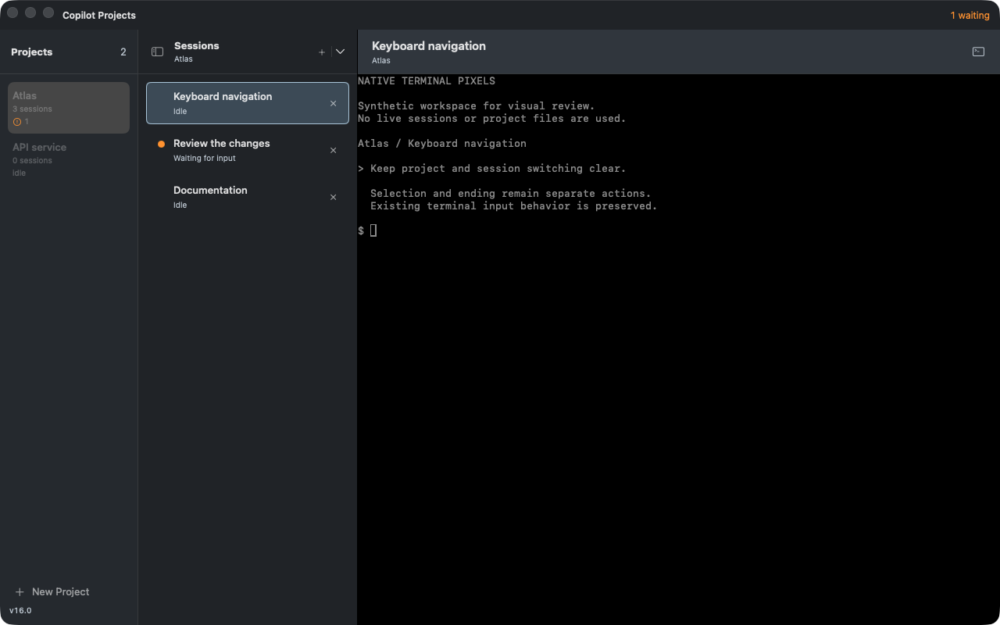
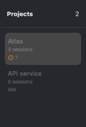

# Copilot Projects

A native macOS terminal workspace for keeping coding-agent sessions organized.
Projects and sessions occupy separate navigation columns, and status indicators tell
you what is running, what needs input, and what finished while you were away.



Native workspace captures use isolated sample projects and illustrative terminal
text. No live workspace content is shown. This unfocused-window capture was
produced by the native Actions workflow; its origin is embedded in the PNG.

## Install

Requires **macOS 26 or later on Apple Silicon**.

Download the latest `Copilot-Projects-<version>.dmg` from
[Releases](https://github.com/sirfergy/copilot-projects/releases), open it, and drag
**Copilot Projects** into **Applications**. Published release builds are Developer
ID–signed, notarized, and stapled.

This repository builds the **standalone desktop app**. Web access, mobile-client
connectivity, tunnel authentication, and remote push delivery are maintained and
built separately; they are not included in the public desktop distribution.
If you already use a remote-enabled installation, keep using its integrated
distribution rather than replacing it with the standalone download.

## Remote screenshot attachments

Remote integrations can stage PNG/JPEG screenshots privately and attach them to
an existing Copilot conversation through the native SDK message path. This needs
an updated integrated host/client and a restarted Copilot tracker advertising
`image-attachments-v1`; text-only clients remain compatible. The tracker verifies
the selected model's image limits and resolves session/epoch-bound upload IDs to
inline image bytes before sending. Missing or unsupported images reject the
whole message, never fall back to terminal input.

Uploads are limited to four images, 2 MiB each, and 16 megapixels, further reduced
by the selected model's limits. They live outside project repositories in the
private state directory, expire after seven days, and are reclaimed on subsequent
uploads. Storage is capped at 128 MiB/128 entries without evicting unexpired
uploads. This repository does not add an upload UI to the standalone desktop app.

## Transcript images

The Mac session-details drawer displays retained inline terminal images beneath
their associated turn. Select an image for a larger, zoomable native preview;
Done, Command-W, or Escape dismiss the preview without ending the session.
Loading and unavailable states keep their space, and decoding is bounded and
off the main actor. No Markdown image URLs or arbitrary file paths are fetched.

Native and remote transcript images keep their original turn when the terminal retransmits
unchanged, still-advertised image data. A redraw does not move an older image to
the newest reply. This retains the existing one-image-per-terminal-ID model;
it does not reconstruct attachment history after image data has been discarded.
Images restored from disk without a recorded display origin remain available in
the terminal but are not guessed into a historical transcript turn.
An open preview pins the image being inspected, even if the terminal later
discards it. Closing the drawer or switching sessions dismisses that preview.

## A workspace for parallel work

- **Projects, sessions, and work.** Choose a project, scan its vertically listed
  sessions, and work in the terminal beside them. Hide the project column to
  reclaim space; background sessions keep running.
- **Attention at a glance.** Running and waiting indicators, unread markers,
  and native notifications help you find the session that needs you. Pending
  questions keep the waiting indicator visible even while other activity continues.
- **Session details.** Read completed turns as Markdown and see usage,
  background agents, and schedules when the
  connected Copilot CLI supports them.
- **Find any session.** Press `⌘K` to search every project's sessions by name,
  project, folder, or what you worked on. Luna suggests matches by meaning.
- **Pull requests by goal.** Press `⇧⌘P` to open Copilot Pull Requests, a companion
  app that lays out your open pull requests as goal lanes across Draft, Checks,
  Review, and Ready, flags the ones that need you, and takes you to the session
  working on them.
- **Local pull-request reviews.** Choose **Review Pull Request…** from the split
  button's dropdown to open a Copilot CLI session with a local adversarial-review
  prompt for a GitHub pull request.
- **Resumable terminals.** The bundled `dtach` backend keeps shells and agents
  alive when the app quits or relaunches. You can also reattach over SSH.

Copilot CLI hooks and a local tracker supply automatic status and session
details. Other command-line tools work as ordinary terminal sessions and can
report status through the CLI.
Tracker-backed session details and resuming Copilot conversations after a
reboot require Copilot CLI experimental extensions; enable them with
`/experimental on` and restart existing Copilot sessions. Terminal
reattach after an app relaunch remains available without them.

### Compact project navigation



The rail stays compact while session names have their own scrollable column.
Full project names and activity summaries remain available through tooltips and
accessibility labels.

## Everyday controls

| Action | Shortcut |
|---|---|
| New project | `⌘N` |
| New Copilot session | `⌘T` |
| New plain terminal | `⌥⌘T` |
| End the current session | `⌘W` |
| Next / previous session | `⌃Tab` / `⌃⇧Tab` |
| Find a session | `⌘K` |
| Show pull requests | `⇧⌘P` |
| Jump to a project | `⌘1`–`⌘9` |
| Jump to a session | `⌃1`–`⌃9` |
| Show / hide Projects | `⌘0` |

Hold `⌘` or `⌃` to reveal numbered navigation hints. Use the session-details
button to open the completed-turn drawer.

### Find a session

**Find Session…** (`⌘K`, also in the Session menu) lists every session across
your projects, most recently active first. Type to filter instantly by session
name, project, folder, or the text of its conversation. Use `↑`/`↓` (or
`⌃N`/`⌃P`) to move, Return to switch to that session, and Escape to clear the
search or close the finder.

When you pause typing, Luna (`gpt-6-luna`, always) also suggests sessions that
match what you described rather than the exact words, with a short reason.
Its picks never reorder the instant matches; extra picks appear below them.
Luna runs through the Copilot CLI you're signed in to, with no tools, in a
temporary Copilot home that is deleted afterwards, so these lookups don't add
sessions to your Copilot history or load your MCP servers. It sees each
session's name, project, folder, and short excerpts of its first and recent
requests and latest reply. If the Copilot CLI is missing or signed out, the
instant results still work and the finder says why Luna couldn't help.

### Pull requests by goal

**Pull Requests** (`⇧⌘P`, in the Window menu and the menu bar extra) opens
**Copilot Pull Requests**, a separate app that ships inside Copilot Projects, or
brings it forward when it's already open. It has its own Dock icon and stays in
`⌘Tab` while it's open, so you switch between it and your sessions like any other
app. To keep it in the Dock, Control-click its icon and choose **Options ▸ Keep in
Dock**. Closing its window quits it; that never ends a session.

It shows your open pull requests. Each row is a goal: a set of pull requests
working toward one outcome. Its columns are the stages Draft, Checks, Review, and
Ready, so one row shows how far a goal has got and what is holding it up.
Non-draft PRs also show an eye icon and **Ready for review**, independently of
their column. This means reviews can start, not that the PR is approved or ready
to merge; a PR can display it while remaining in **Checks** with checks running.

- **Goals come from your sessions.** A pull request belongs to the live Copilot
  session whose conversation keeps naming its head branch: the session that pushes
  the branch, not one that merely reviews or lists it. Pull requests sharing a head
  branch across repositories join the same goal. To regroup one, open its
  menu and choose **Move to Goal ▸** another goal or **New Goal…**.
- **What needs you** is ranked: a linked session waiting for your input, merge
  conflicts, failing *required* checks (optional failures don't count), changes
  requested, unresolved review threads (Copilot's are called out), ready to merge,
  and behind its base branch (only after review, and never with a merge queue).
  Pull requests with no live session, or with no activity for three days, are
  flagged more quietly. Goals whose sessions need you come first.
- **Act from it.** **Go to Session** brings Copilot Projects forward on the goal's
  session. A goal with no session offers **Start Session**, which opens Copilot in
  the current project (or one you pick) with the pull request links as its prompt,
  then shows it. When an ended Copilot session worked on the goal, it offers
  **Resume Session** instead, reopening that session in a new tab in the folder it
  worked in (its menu still has **Start New Session**). Ended sessions are found
  through the Copilot CLI's local session store; one whose folder is gone, or that
  another Copilot CLI has open, isn't offered. Double-click a pull request, or press
  `⌘Return`, to open it on GitHub. Use `↑`/`↓` to move and Return to go to its session.
- **Focus without losing context.** **All** keeps every goal visible; **Needs you**
  keeps goals with at least one PR needing attention, including their quieter
  sibling PRs. A shared session's status appears beside the goal, leaving each PR
  to show its own blocker or readiness. **Resume in _project_** names the destination
  before you click. GitHub freshness, incomplete status, and the connection to Copilot Projects are
  shown separately, and session creation waits until matching finishes.
- **Copilot Projects closed?** The lanes keep the sessions it last reported, with
  their states unknown, and their buttons become **Open Copilot Projects**. A
  Copilot Projects too old to list its sessions is called out above the lanes in
  the window: update it to match sessions again.
- **Owners** limits the window to one or more organizations or users, such as
  `github` and `my-org`; each is its own token in the Owners popover. Only pull
  requests in those owners appear. Leave it empty to include every owner, up to
  your hundred most recently updated pull requests. It's saved with Copilot
  Projects' settings.

The public host also exposes this engine through `SessionHost`'s
`pull-request-overview-v1` contract for remote clients. It uses its own caches,
reads the helper's goals without writing them, and regroups cached GitHub facts
against the live workspace on every request. GitHub refreshes are single-flight:
at most once per five minutes, or once per minute for explicit Refresh, including
failed attempts. No remote polling means no GitHub refresh timer.
The remote `isRefreshing` flag also covers local transcript matching and active
previous-session searches, including deferred passes, so clients keep polling
quickly until those results settle without requesting GitHub on each poll.

Remote Start/Resume requests contain only project/session identities and canonical
PR keys. Start uses the same working directory as local Start in the chosen
project (its selected tab's folder, then the project default); Resume uses the
previous session's recorded directory. Neither changes Mac selection or opens a
window. Associations are persisted on the workspace session, and request IDs bind
the complete intent in the existing creation ledger. Both fresh Start and Resume
wait for GitHub status and workspace matching, and refuse PRs already claimed by
a live session. Existing live sessions remain navigable while the first refresh loads.
Retry the same request after an uncertain outcome; clients must expire pending
retries after 24 hours.

The window reads GitHub with the accounts you signed in to with the GitHub CLI
(`gh auth login`); every signed-in github.com account is included. Tokens stay in
memory, and requests go straight to the GitHub API. It refreshes when opened
and every five minutes while open, or on demand with `⌘R`. It reads your sessions
from Copilot Projects over its local control socket every two seconds while its
window is visible. Matching pull requests to sessions reads each live session's
Copilot CLI event log once, then only what was added since. Looking for an ended
session reads, in the background and 1 GB at a time, only the event logs of
sessions the Copilot CLI's session store ties to a pull request, each once. The
match counts and any goals you name are kept under
`~/.local/state/copilot-projects/pull-requests/`. Only one copy of the app writes
there; opening another brings the first forward. If that folder can't be locked,
the window opens anyway and says that it saves nothing.

VoiceOver exposes each session's selection and attention state, with separate
select and end actions. The session-details drawer uses a fade instead of
sliding when Reduce Motion is enabled.

The **+** side of the split button starts an interactive Copilot CLI session immediately,
inheriting the current session's working directory. Its dropdown offers
**Start with Prompt…** (a multiline composer), **New Terminal** (just a shell), and
**Review Pull Request…** (a GitHub pull request URL dialog).
The Session menu and project context menus also offer Copilot, starting-prompt,
and plain-terminal creation. New projects
created with `⌘N` also start with Copilot. Copilot Projects never adds `--allow-all`;
tool approvals follow your normal Copilot CLI permission settings.

In the composer, Return adds a line, `⌘Return` starts Copilot, and Cancel creates
no session. Failed preflight checks keep your draft. If Copilot or its backend becomes
unavailable, choosing **New Terminal** discards the draft and opens a plain shell
without submitting it. If startup fails after a session opens, right-click its row
and choose **Copy Starting Prompt** before closing it or quitting the app. This
in-memory copy is never automatically resubmitted.

**Ending a session stops its processes. Quitting the app does not**, when the bundled
`dtach` backend is available. Closing the last window quits by default; enable
**Keep Running When Window Closes** to leave the host in the menu bar.
Plain-shell scrollback does not survive a detach; full-screen tools can repaint
when reattached.

**End Session** (including `⌘W` and the session row's x button) asks for confirmation when
the app reports running, waiting, background, scheduled, or pending-input work.
A single idle session ends immediately; unread completion markers alone do not
trigger a prompt. **End Project** also confirms whenever it contains multiple
sessions. Cancel ends nothing, and a project that gains sessions while the dialog
is open must be reviewed again. Ending removes sessions from the workspace and
stops their processes; project files are not deleted.

These are user-interface safeguards based on reported activity, not a new process
detector. Automation and raw terminal commands retain their existing behavior.

Remote clients can send **Other** text answers to Copilot's boolean questions.
The host preserves these as strings; ordinary True/False answers remain booleans.
MCP-provided boolean forms and synthetic terminal-default prompts remain
boolean-only. Ship this host update before a client that offers boolean Other
answers; older hosts reject those strings.

## Command-line access

On first launch, the app installs a launcher at `~/.local/bin/copilot-projects`.
Add that directory to your `PATH` if needed.

```bash
copilot-projects ping
copilot-projects list-projects
copilot-projects list-status
copilot-projects new-session --project <id> --cwd /path/to/repo
copilot-projects focus --session <id>
copilot-projects doctor
```

The automation command `new-session` still creates a plain shell. To start Copilot
with a prompt from a script, use `new-copilot-session`:

```bash
copilot-projects new-copilot-session --project <id> \
  --request-id <uuid> --prompt-file prompt.md --title "Review owner/repo#123"
```

It launches Copilot in `~/Repos` with the file's contents (UTF-8,
at most 8 KiB) as the starting prompt, then prints the session id. The request id
is the session id, so retries are idempotent while the app remembers the request
(about a week): replaying the same id and prompt prints the existing session, a
different prompt or project exits 3 (conflict), and an id whose session has since
ended exits 4 (gone, not recreated). Exit 5 means
Copilot or persistence is temporarily unavailable; retry with the same id. Other
exits: 2 invalid arguments, 6 unknown project, 7 missing `~/Repos`, 1 anything else
(including an older app that does not support the command). Unknown flags are
rejected before anything is sent.

To end a session from a script, use `close-session`:

```bash
copilot-projects close-session --session <id> --project <id>
```

It ends the session the same way **End Session** does, but without a confirmation
dialog. The session is always named explicitly; the calling terminal's session is
never implied. Because no one confirms the close, a session that has active or
pending work (running, waiting for input, background agents, or scheduled turns)
or is the selected tab of the selected project is left alone and the command
exits 8 (busy); retry later. `--project` refuses (exit 3) a session that has since
been moved to another project. Exit 4 means the session no longer exists, 5 means
the workspace state is unavailable (retry), 2 invalid arguments, and 1 anything
else. An app too old to support the command exits 2 or 1 with `unknown command`.

Commands inside an app-managed terminal automatically target its current
project and session. Hooks for other agents can use:

```bash
copilot-projects set-status running
copilot-projects set-status waiting --text "needs approval"
copilot-projects notify "Build finished"
copilot-projects set-status idle
```

For SSH reattachment:

```bash
ssh you@mac
copilot-projects ls
copilot-projects attach <id-or-prefix>
```

Use `Ctrl-\` to detach without ending the session.

## Studio Console visual system

Studio Console frames the native terminal workspace with adaptive graphite/satin
surfaces, steel session selection, and readable system type. The Two-Level Browser
replaces horizontal tabs with Projects | Sessions | Terminal, preserving native
controls, keyboard shortcuts, drag/drop, and ending safeguards. The project column
can collapse without recreating the terminal; session details stay secondary. The source-grounded
[design record](DESIGN.md) and [token sidecar](.impeccable/design.json) accompany
the [product context](PRODUCT.md). Appearance follows macOS rather than a separate
theme picker.

### Native workspace screenshots

The **Capture macOS workspace** Actions workflow renders the actual native views
with isolated synthetic sessions on the M4 runner. It uploads dark, light, compact,
and collapsed-project captures with a source-SHA manifest and diagnostic logs. Each
successful image must contain the terminal's unique OCR marker and use the Metal
renderer; an empty terminal or unavailable GUI/capture permission fails the run.
It never captures the whole desktop, launches a live host, or changes TCC grants.

Capture runs are triggered by pushes to `sirfergy/studio-console` and
`sirfergy/studio-console-bold`. Manual
dispatch becomes available after the workflow is present on the default branch.
Ordinary test runs skip the capture. The driver packages a debug-only SwiftPM
application and launches that test-owned app through LaunchServices, without
starting the shipping host's bootstrap or services. Its real
AppKit event loop runs the same asynchronous fixture as the XCTest wrapper.
Headless runs exercise the production input dispatcher for preview dismissal,
workspace-action suppression/restoration, and zero terminal input, plus native
accessibility controls and actual own-window screenshots. They do not require
an active/key window or claim OS-level physical-key validation. The
driver uses a private temporary home and state directory, a harmless terminal
process, a bounded application lifetime, and a replacement environment that does
not expose runner credentials to the fixture. Successful captures also verify
that the fixture's terminal processes have exited.

## Build and contribute

Requires Xcode 26 or later and macOS 26 or later.

```bash
git clone https://github.com/sirfergy/copilot-projects.git
cd copilot-projects
./scripts/build-app.sh --launch
```

The app uses [SwiftTerm](https://github.com/migueldeicaza/SwiftTerm) for terminal
rendering, with Metal and a CoreGraphics fallback. Local builds use an available
Developer ID identity, falling back to ad-hoc signing. Ad-hoc builds do not
preserve the signing identity of a published release.

```bash
swift test --package-path Packages/SessionDomain
./scripts/check-tracker.sh
python3 scripts/test-release.py
swift test
swift test -c release --filter SessionCloseIntegrationTests
```

The session-close integration covers the Command-W action with real terminal
processes and asynchronous cleanup. The remote companion also runs it with its
production dependencies linked, since the sleep-specialization crash depends on
the optimized binary's linked modules.

See the [usage and development guide](docs/usage.md) for hook behavior, tracker
upgrades, troubleshooting, rendering, and release instructions.

## Storage and integrations

Workspace state and session artifacts live under
`~/.local/state/copilot-projects/`. The local control socket is restricted to the
current user. Review terminal contents, transcripts, notifications, and screenshots
before sharing them; they can contain the work you are doing.

The public `CopilotProjectsHost`, `CopilotProjectsProtocol`, and
`CopilotProjectsUI` package products support separately built integrations without
making the desktop depend on a private repository. The standalone app reports
remote commands as unavailable and leaves existing remote settings unchanged.

`SessionHost.createProject` creates an empty, named group without starting a shell
or requiring Copilot, `dtach`, or a repository folder. Integrations retain the
same request ID and name for retries. Successful creation is acknowledged only
after workspace and replay-ledger persistence; remembered requests cannot recreate
a deleted project. Replay records are bounded to 512 entries and seven days.

## License

[MIT](LICENSE). The bundled `dtach` helper is licensed under GPLv2; its source is
included in [`vendor/dtach`](vendor/dtach).
